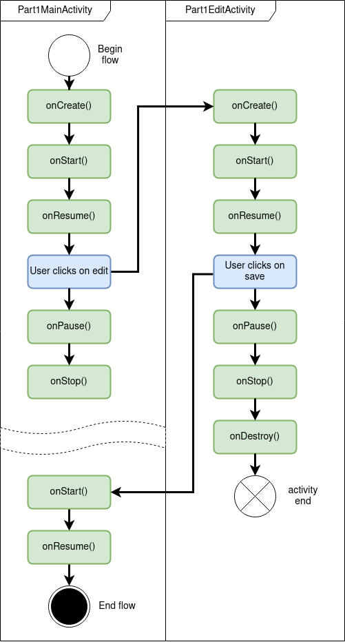

# DAA - laboratoire 2
## Les briques logicielles de base 
## Les Activités et les Fragments

Date : 31.10.2023

Membres :
- Felix Breval
- Anthony David
- Timothée Van Hove

Classe: DAA-TIC-B

Professeur : Fabien Dutoit

Assistant : Ilias Goujgali 


## Introduction

Afin de  développer des applications efficaces, il est important de comprendre les rouages de base de l'architecture Android. Dans ce  laboratoire, nous avons exploré les briques logicielles essentielles du SDK, en mettant un accent particulier sur les  activités et les fragments. L'objectif est de comprendre le fonctionnement interne de ces éléments mais aussi de comprendre leur interaction.

**Activité principale**:

Nous avons choisi d'implémenter une activité principale permettant à l'utilisateur d'accéder aux 3 parties du labo sur l'appui d'un bouton. Cela nous permet de plus facilement séparer le travail. 

**Petit extra**:

Nous avons choisi d'implémenter le layout de l'activité principale dans un `DrawerLayout`, ce qui nous permet d'y afficher une `NavigationView` personalisée quand l'utilisateur appuie sur un `ImageButton`. Dans la `NavigationView`, nous avons affiché le nom des membres de notre groupe, ainsi qu'un lien vers le repo github du laboratoire. Le lien s'ouvre dans le navigateur par défaut gr^ace à in `intent` implicite.

**Theme**:

Nous avons choisi de changer la thème principal en orange (couleur de la HEIG), ainsi que le corner radius des boutons de base, pour qu'ils soient identiques à ceux présents dans la consigne. Les thèmes sont changés dans res/values/themes.xml

## 1. Activités

Durant la mise en œuvre de cette partie, nous avons décidé d'implémenter une activité parente *Part1BaseActivity* qui fait un logging des appels de méthodes de changement d'état (lifecycle). Les deux activités principales *Part1MainActivity* et *Part1EditActivtiy* héritent de cette activité parente afin que tout changement d'état soit loggé.

Lorsque l'utilisateur appui sur le bouton "back" dans la deuxième activité (soit Part1EditActivtiy ), l'appel qui provient du bouton *save* ne sera jamais fait, l'activité se termine pas avec un code de résultat RESULT_OK et donc ne va pas renvoyer un nouveau nom. Mais si l'on regarde mieux les appels de changement d'état, on peut voir que, pour l'activité d'édit, onPause() est call, on switch à l'activité Main puis onStop() et onDestroy() sont call.

Pour la mise en œuvre de la rotation d'écran, ce qui est important est de de comprendre est ce qui se passe lors de la rotation. L'activité est mise en pause, détruite puis reconstruite. Il faut donc sauver le nom dans un bundle, ce qui est faisable avec *onSaveInstanceState* et *onRestoreInstanceState*. On sauve le nom actuel dans *onSaveInstanceState* juste avant sa déstruction et lors d'un *onRestoreInstanceState* on récupère le nom qui vient d'être sauvé.


Diagramme des états quand l’utilisateur ouvre l’application, clique sur le bouton éditer, renseigne son prénom et sauve:




Diagramme des états quand l’utilisateur ouvre l’application en mode portrait, clique sur le bouton éditer, bascule en mode paysage, renseigne son prénom et sauve:


## 2. Les fragments, premiers pas

Dans notre mise en œuvre de l'activité hébergeant deux fragments, plusieurs observations sont à noter. Premièrement, les deux fragments fournis, à savoir le CounterFragment et le ColorFragment, sont conçus pour implémenter la restauration de leur état, offrant une expérience utilisateur cohérente même en cas de changements de configuration, tels que la rotation de l'écran. Cependant, un aspect intéressant réside dans le fait que le ColorFragment est capable de restaurer sa couleur, même en l'absence d'une sauvegarde explicite de son état. Cette capacité s'explique par le comportement par défaut d'Android, qui sauvegarde et restaure automatiquement l'état de certaines vues et éléments de l'interface utilisateur. Lorsqu'un changement de configuration se produit, Android conserve l'état de ces éléments, ce qui permet au ColorFragment de restaurer la couleur précédemment sélectionnée sans nécessiter une intervention explicite du développeur.

D'autre part, si l'on envisage de placer deux instances du CounterFragment dans l'activité, nous constatons qu'elles fonctionnent de manière indépendante. En cas de rotation de l'écran, chaque instance du CounterFragment maintiendra son propre état, ce qui peut conduire à des valeurs distinctes pour chaque instance. Cela est dû au fait que chaque Fragment est associé à l'activité qui les héberge, et Android gère la restauration de leur état en conséquence. Les deux instances du CounterFragment ne partagent pas d'état commun, ce qui signifie que leurs compteurs sont indépendants les uns des autres. Cela reflète le comportement attendu, car chaque Fragment conserve son propre état en fonction de l'Activité parente, ce qui garantit une restauration correcte de l'état, même en cas de plusieurs instances du même Fragment dans une même activité.

## 3. Le FragmentManager

### 3.1 Implémentation

L'UI est gérée principalement par l'activité `Part3MainActivity`, qui contient des boutons pour naviguer à travers les différentes étapes. Cette activité est liée à son fichier XML correspondant à l'aide d'un View Binding, offrant ainsi un moyen efficace et type-safe d'interagir avec les composants de l'UI.

Lors de la création de l'activité `Part3MainActivity`, une vérification est effectuée pour s'assurer que l'activité n'est pas en train d'être recréée (comme lors d'une rotation). Si l'activité est nouvellement créée, le premier fragment est affiché en utilisant une transaction. Cela est assuré par le bloc de code suivant :

```kotlin
if (savedInstanceState == null) {
    supportFragmentManager.commit {
        add(R.id.fragment_container, Part3Fragment.newInstance(1))
        addToBackStack(null)
    }
}
```

**Gestion de la Navigation**:

Lorsque l'utilisateur clique sur le bouton "next", le compteur actuel des entrées dans la pile de retour est récupéré. En utilisant ce compteur, l'étape suivante est déterminée et le fragment correspondant est remplacé dans le conteneur.

La gestion du bouton "back" se fait en vérifiant le nombre de fragments dans la pile de retour. Si plusieurs fragments sont présents, le fragment actuel est sorti pour révéler le précédent. Sinon, l'activité est terminée.

Lorsque l'utilisateur clique sur le bouton "close", l'activité est simplement terminée.

Nous avons aussi overridé le comportement par défaut du bouton "back" d'Android. Lors d'un appui sur le bouton "back" d'Android, l'activité se termine. Nous avons fait cela, car nous trouvions ce comportement plus logique et user-friendly.

Chaque étape est représentée par une instance du fragment `Part3Fragment`. Ce fragment prend un argument pour connaître l'étape actuelle et affiche le numéro d'étape à l'aide d'un `TextView`. La méthode statique `newInstance` permet de créer facilement de nouvelles instances de ce fragment avec l'étape souhaitée comme argument.

### 3.2 Questions

### 3.1 Initialisation de l'activité et affichage automatique de la première étape

Lors de l'initialisation de l'activité Part3MainActivity, un contrôle est effectué pour déterminer si l'activité est créée pour la première fois ou si elle est recréée (par exemple, après un changement de configuration telle que la rotation).

La vérification `if (savedInstanceState == null)` est une approche courante pour déterminer si l'activité est créée pour la première fois ou si elle est recréée. Si l'activité est créée pour la première fois, le fragment initial est ajouté. Cela permet de s'assurer que la première étape n'est affichée automatiquement qu'une seule fois lors du lancement initial de l'activité, et non lorsqu'elle est recréée à la suite de changements de configuration ou pour d'autres raisons.

### 3.2 Prise en charge de la rotation de l'écran

Nous utilisons le mécanisme par défaut Android pour gérer la restauration de l'état des fragments lors des changements de configuration.

Lorsque l'écran pivote, Android détruit puis recrée l'activité en cours pour gérer les nouvelles configurations. Par défaut, Android enregistre et restaure l'état de la pile de fragments lors de ces redémarrages d'activité. Avec notre implémentation, la pile de fragments (avec tous les fragments ajoutés) est automatiquement préservée pendant la rotation. De plus, en utilisant la vérification `savedInstanceState`, nous nous assurons que nous n'ajoutons pas de fragments initiaux redondants lorsque l'activité est recréée en raison de la rotation.

Finalement,  la persistance du numéro de l'étape en cours à travers les rotations de l'écran est assurée par l'utilisation d'arguments de fragment. La gestion automatique de la pile et de l'état d'instance sauvegardé de l'activité garantit que la pile de fragments et le numéro de l'étape en cours restent cohérents à travers les rotations de l'écran.

### 3.3 Transaction par fragment : Différence entre les méthodes `add` et `replace`

Dans le code donné, la méthode `add` est utilisée pour introduire le premier fragment, tandis que la méthode `replace` est utilisée pour les fragments suivants, au fur et à mesure que nous naviguons à l'aide du bouton "next".

La méthode `add`  ajoute un fragment sans supprimer le fragment actuel. Les deux fragments  coexisteront, mais celui ajouté sera au-dessus. Si nous ajoutons plusieurs fragments sans en supprimer aucun, ils seront tous présents  dans la pile de retour, et en appuyant sur le bouton de retour, chacun  d'eux sera sorti, révélant celui qui se trouve en dessous.

La méthode `replace` permet de supprimer le fragment actuel et d'en ajouter un nouveau. Le fragment remplacé n'existera plus dans le conteneur de fragments, mais restera dans la pile arrière si `addToBackStack` a été utilisé. Par conséquent, si nous appuyons sur la touche retour après une opération de remplacement (avec `addToBackStack`), nous reviendront au fragment précédent.

Dans notre scénario, l'utilisation de `replace` pour les fragments suivants garantit que seul le dernier fragment est visible dans le conteneur à tout moment. Mais grâce à l'utilisation de `addToBackStack`, les utilisateurs peuvent toujours revenir aux étapes précédentes.


## Conclulsion

À travers une série d'exercices et de mises en œuvre impliquant la gestion du cycle de vie, la restauration d'états dans des fragments, chaque exercice nous a offert un aperçu sur l'importance de chaque composant dans l'écosystème Android. 

La capacité de gérer et de restaurer l'état d'une application, notamment après des interruptions comme une rotation d'écran, est essentielle pour offrir une expérience utilisateur homogène. De plus, notre exploration du `FragmentManager` et de ses transactions nous a permis de saisir la flexibilité offerte par les fragments lors de la construction d'UI.
